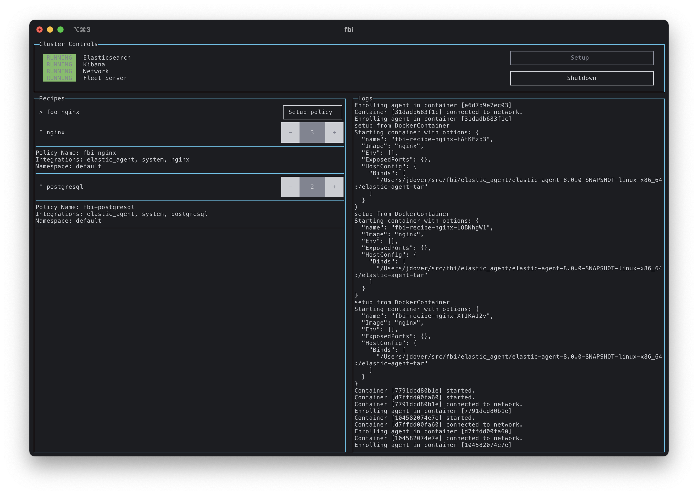

# fbi

Tool for orchestrating Fleet Server and pre-configured Elastic Agents monitoring
real software (eg. nginx).



## Get Started

### Install pre-requisites
- Node.js 14+
- Docker
- Start Elasticsearch 8.0.0 snapshot with:
    ```sh
    bin/elasticsearch -E xpack.security.authc.api_key.enabled=true -E http.host=0.0.0.0
    ```
- Start Kibana 8.0.0 snapshot (or dev) with:
    ```sh
    bin/kibana --server.host=0.0.0.0
    ```

### Clone & configure
- Clone and bootstrap:
    ```sh
    git clone git@github.com:joshdover/fbi.git
    cd fbi
    npm run bootstrap
    ```
- Find your private IP address and update `kibana.host` and `elasticsearch.host` in `config/fbi.yml`
- Configure Fleet settings in Kibana UI:
  - Fleet Server host:  `http://fleet-server:8220`
  - Elasticsearch host:  `http://<your private ip>:9200`
- Start the tool:
    ```sh
    npm start
    ```
- To exit, press Ctrl+C (will shutdown all containers and unenroll agents) or Ctrl+D (will exit without cleaning up)

## Recipes

FBI supports "recipes" which allow you to define a configuration for containers
with an associated Agent Policy that will get created for you. This is useful
for testing certain integrations or sets of configuration in a reproducible way.

FBI will load recipes from the `./recipes` directory on disk.

### Basic Example

```yaml
id: nginx  # unique ID to be displayed in the UI
container: # Docker container configuration to launch for each instance
  image: nginx 
policy:
  integrations: # list of Elastic package integrations to add to the agent policy
    - package: elastic_agent
    - package: system
    - package: nginx
```

### Advanced Example

```yaml
id: foo nginx
container:
  image: nginx
  env:
    MY_VAR: value
policy:
  name: Foo Nginx Machines
  namespace: foo
  unenroll_timeout_s: 120
  monitoring: []
  integrations:
    - package: elastic_agent
      namespace: default
      name: "Agent monitoring"
    - package: system
      name: "System metrics"
    - package: nginx
      version: 0.3.0
      name: "Acme webservers"
```
